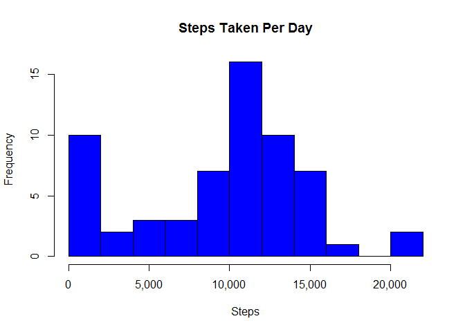
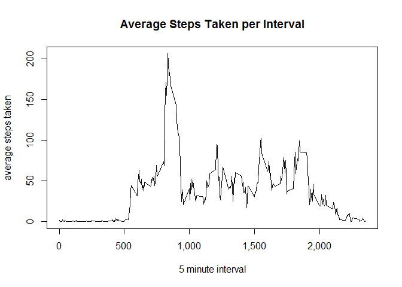
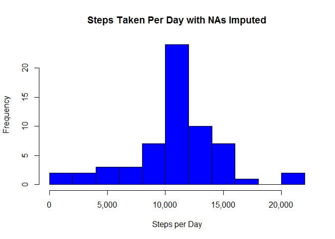
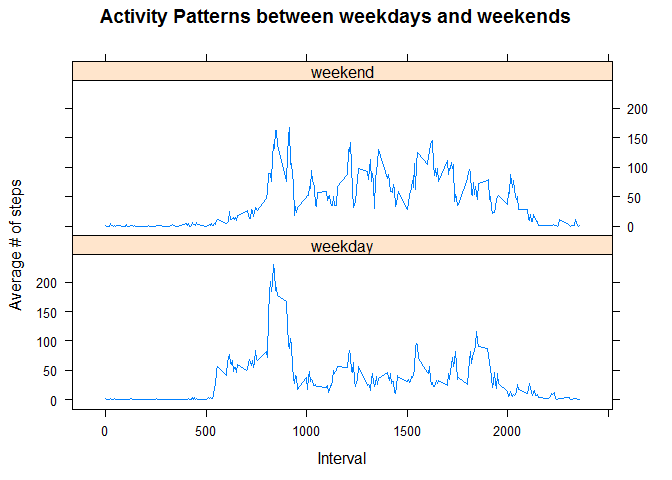

# PA1_template.Rmd
Mountaineer569  
December 2015  

Load libraries.

```r
library(plyr)
```

### Loading and preprocessing the data.


*1. Load the data.

```r
activity <- read.csv(paste(path,"repdata_data_activity/activity.csv",sep = "/"),
        header=TRUE, sep=",", stringsAsFactor=FALSE, na.strings="NA")
```

*2. Format Date and Time fields.

```r
activity$date <- strptime(activity$date, format = "%Y-%m-%d")
```

Summarize the data to see what it contains.

```r
summary(activity)
```

```
##      steps             date                        interval     
##  Min.   :  0.00   Min.   :2012-10-01 00:00:00   Min.   :   0.0  
##  1st Qu.:  0.00   1st Qu.:2012-10-16 00:00:00   1st Qu.: 588.8  
##  Median :  0.00   Median :2012-10-31 00:00:00   Median :1177.5  
##  Mean   : 37.38   Mean   :2012-10-31 00:25:34   Mean   :1177.5  
##  3rd Qu.: 12.00   3rd Qu.:2012-11-15 00:00:00   3rd Qu.:1766.2  
##  Max.   :806.00   Max.   :2012-11-30 00:00:00   Max.   :2355.0  
##  NA's   :2304
```

### What is mean total number of steps taken per day?
*1. Calculate the total number of steps, mean and median of the total number of steps taken per day. Ignore the missing values. Note the use of the '.' function to allow variables to be used without quoting.

```r
daystats <- ddply(activity, .(date), summarize, 
                  daysum = sum(steps, na.rm = TRUE),
                  daymean = round(mean(steps, na.rm = TRUE),1),
                  daymedian = round(median(steps, na.rm = TRUE),1))
```
Show a sampling of the total number of steps taken per day, variable "daysum".

```r
head(daystats)
```

```
##         date daysum daymean daymedian
## 1 2012-10-01      0     NaN        NA
## 2 2012-10-02    126     0.4         0
## 3 2012-10-03  11352    39.4         0
## 4 2012-10-04  12116    42.1         0
## 5 2012-10-05  13294    46.2         0
## 6 2012-10-06  15420    53.5         0
```

*2. Histogram of the total number of steps taken each day.

```r
hist(daystats$daysum 
     , breaks = 10 
     , main="Steps Taken Per Day"
     , xlab="Steps"
     , ylab="Frequency"
     , col="blue"
     ,xaxt="n")
axis(side=1, at=axTicks(1), labels=formatC(axTicks(1), format="d", big.mark=',')) #add commas to x-axis
```

 

*3. Report the mean and median total number of steps taken per day.

```r
paste("Mean steps taken per day = ", round(mean(daystats$daysum, na.rm=TRUE),2))
```

```
## [1] "Mean steps taken per day =  9354.23"
```

```r
paste("Median steps taken per day = ", round(median(daystats$daysum, na.rm=TRUE),2))
```

```
## [1] "Median steps taken per day =  10395"
```

### What is the average daily activity pattern?
*1. Make a time series plot (i.e. type = "l") of the 5-minute interval (x-axis) and 
the average number of steps taken, averaged across all days (y-axis).

```r
intstats <- ddply(activity, .(interval), summarize, 
                 intsum = sum(steps, na.rm = TRUE),
                 intmean = round(mean(steps, na.rm = TRUE),1))
```

```r
plot.ts(intstats$interval, intstats$intmean 
        ,type="l" 
        ,xlab="5 minute interval" 
        ,ylab="average steps taken"
        ,main="Average Steps Taken per Interval"
        ,xaxt="n")
axis(side=1, at=axTicks(1), labels=formatC(axTicks(1), format="d", big.mark=',')) #add commas to x-axis
```

 

*2. Which 5-minute interval, on average across all the days in the dataset, 
contains the maximum number of steps?

```r
maxsteps <- which(intstats$intmean == max(intstats$intmean))
intstats[maxsteps,]
```

```
##     interval intsum intmean
## 104      835  10927   206.2
```

### Imputing missing values
*1. Calculate and report the total number of missing values in the dataset.

```r
paste(sum(is.na(activity$steps)),"missing values for variable steps.")
```

```
## [1] "2304 missing values for variable steps."
```

*3. Create a new dataset that is equal to the original dataset but with the missing data filled in.  

```r
activitynona <- merge(activity, intstats, by = "interval")
```
*2. Fill in missing values with the __interval average across all days__.

```r
activitynona$steps[is.na(activitynona$steps)] <-  
    activitynona$intmean[is.na(activitynona$steps)]
```

Calculate statistics of steps taken per day with imputed values, for later use.

```r
daystatsnona <- ddply(activitynona, .(date), summarize, 
                      daysum = sum(steps, na.rm = TRUE),
                      daymean = round(mean(steps, na.rm = TRUE),1),
                      daymedian = round(median(steps, na.rm = TRUE),1))
head(daystatsnona)
```

```
##         date  daysum daymean daymedian
## 1 2012-10-01 10766.2    37.4      34.1
## 2 2012-10-02   126.0     0.4       0.0
## 3 2012-10-03 11352.0    39.4       0.0
## 4 2012-10-04 12116.0    42.1       0.0
## 5 2012-10-05 13294.0    46.2       0.0
## 6 2012-10-06 15420.0    53.5       0.0
```

*4a. Make a histogram of the total number of steps taken each day with NAs imputed.

```r
hist(daystatsnona$daysum
     , breaks = 10
     , main="Steps Taken Per Day with NAs Imputed"
     , xlab="Steps per Day"
     , ylab="Frequency"
     , col="blue"
     , xaxt="n")
# add commas to x-axis labels
axis(side=1, at=axTicks(1),labels=formatC(axTicks(1),format="d", big.mark=",")) 
```

 

*4b. Report the mean and median total number of steps taken per day.

```r
paste("Mean steps taken per day = ", round(mean(daystatsnona$daysum),2))
```

```
## [1] "Mean steps taken per day =  10766.19"
```

```r
paste("Median steps taken per day = ", median(daystatsnona$daysum))
```

```
## [1] "Median steps taken per day =  10766.2"
```
*4c. Do these values differ from the estimates from the first part of the assignment?

```r
paste("The imputed data set is identical to the original (T/F)?: ", identical(daystats, daystatsnona))
```

```
## [1] "The imputed data set is identical to the original (T/F)?:  FALSE"
```
*4d. What is the impact of imputing missing data on the estimates of the total daily number of steps?

```r
paste("Imputing values increased(decreased) the average daily steps by ",
      round(mean(daystats$daysum) - mean(daystatsnona$daysum),2))
```

```
## [1] "Imputing values increased(decreased) the average daily steps by  -1411.96"
```

### Are there differences in activity patterns between weekdays and weekends?
*1. Create a new factor variable in the dataset with two levels - 
"weekday" and "weekend" indicating whether a given date is a weekday or weekend day.

```r
activity3 <- mutate(activitynona, dayofweek = weekdays(activitynona$date))
activity4 <- mutate(activity3, daycat = ifelse(grepl('^S',activity3$dayofweek)==TRUE,"weekend","weekday"))
```

*2. Make a panel plot containing a time series plot (i.e. type = "l") of the 5-minute interval
(x-axis) and the average number of steps taken, averaged across all weekday days 
or weekend days (y-axis).
Calculate statistics for day category (weekday or weekend). The daily mean will be used in the graph.

```r
daycatstats <- ddply(activity4, .(interval,daycat), summarize, 
                  daycatsum = sum(steps, na.rm = TRUE),
                  daycatmean = round(mean(steps, na.rm = TRUE),1))


library(lattice)
```

```r
xyplot(daycatmean~interval|daycat, daycatstats
    ,type="l"
    ,main = "Activity Patterns between weekdays and weekends"
    ,xlab="Interval" 
    ,ylab="Average # of steps"
    ,layout=(c(1,2))
)
```

 
